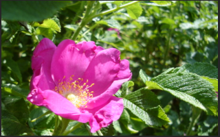
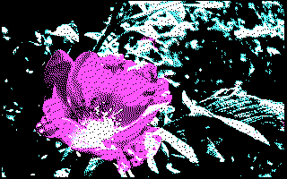

# swpxlt

SWiss PixXLs Tools

Tools for manipulating indexed color images and palettes.

## Summary

Over the years I wrote several small graphics related programs to help prepare game
assets or automate related tasks. Instead of leaving those utilities buried and scattered
across projects for ever, I decided to group them in a single package.

In many cases (such as paltool) I merged or reimplemented functionalities from other tools
rather than simply putting them here as-is. (for instance, the import and export parts
of some dedicated palette conversion tools are now integrated into paltool)

Most of those tools use the command-line and are meant to be invoked from scripts or makefiles for
automated batch processing.

## Dependencies / Runtime

 - libpng and ideally a linux system.
 - SDL 1.2
 - gif_lib (optional, disable by editing Makefile)

On a Debian system, besides the obvious (gcc, make, etc) you need:
 - libpng-dev
 - libgif-dev
 - libsdl1.2-dev


## The Tools

 - swpxlt : An indexed image scale and rotation tool (with scale2x/3x/4x support)
 - paltool : Palette manipulation/creation tool.
 - dither : A tool t help reduce colors (quantize) and dither with a computed or loaded palette.
 - png2vga : Convert PNG to a raw format suitable for VGA mode 13h.
 - flicinfo : Display information about a FLI/FLC file, such as frame size, frame count, speed...
 - flic2png : Convert a FLI/FLC file to a series of PNG files
 - flicmerge : Take FLI/FLC, Animated GIF or PNG files as input and merge them into a single FLC file
 - flicplay : FLI/FLC playback tool using SDL

### swpxlt

I created swpxlt because I needed to generate a large quantity of pre-rotated (indexed color) sprites
at small angle intervals and did not have a good tool callable from a script to automate this.

swpxlt features:
 - Read and write palletized PNG file (True color/RGB not supported{)
 - Nearest-neighbor scale by any factor (-s x.x)
 - Scale2x, Scale3x and Scale4x support (Use -S SCALE2X and -s 2,3 or 4)
 - Rotate by any angle (-r angle)
 - Nice2x[1]/Nice3x/Nice4x/Nice6x/Nice8x rotation support

[1] Nice2x/3x/4x/6x/8x refer to how much the image is upscaled (using a combination of Scale2x/3x/4x) before
rotating and scaling back down. I wanted something that gave reasonable results on pixel art, and based on a
description of the RotSprite algorith, I implement this. Results are not as good as RotSprite I think, but
they are close, and definitely better than nearest-neighbor algorithm.

Here is an example where an image is rotated by -26.5 degrees:

`
./swpxlt -i tv_original.png -R NICE8X -r -26.5 -o tv_nice8x.png
`

From left to right: Original, Rotated with Nearest Neighbor, Rotated with NICE8X, Rotated with RotSprite (For comparison only - RotSprite is not implemented):

    


Here is an example scaling an image by a factor of 3 using the Scale3x algorithm.

`
./swpxlt -i images/rats.png -S SCALE2X -s 3.0 -o images/rats_scale3x.png
`

Normal scale (nearest neighbor):


Scale2x:


### paltool

paltool was originally created for a DOS game where I wanted to easily compose a 256 color VGA
palette by appending colors from several separate image files, but it can also be used as a simple
palette file converter or palette viewer.

By default, if no output format is specified (-f), paltool displays the loaded palette in numerical format:

```
$ ./paltool -i images/flower_cga.png
0: 000000
1: 55ffff
2: ff55ff
3: ffffff
$
```

Using the -x option, paltool can display the palette directly in your terminal if it supports
24-bit true color escape codes (works in xterm, and probably Konsole and many others)


At this time, the resulting palette data can be exported to the following formats (selected by option -f):

 - VGA format (6 bit) in nasm format
 - PNG file format (8-bit) with swatches
 - Autodesk Animator COL file (256 entries / raw 768 bytes)
 - Autodesk Animator Pro COL file (Header + (n * 3 bytes))

For instance, to load the palette from a PNG file and export it in .COL (animator) format:

`
./paltool -i palette.png -o palette.col -f animator
`

paltool can load colors from different sources (-i) and the format is auto-detected.

 - PNG (loads palette from a .PNG image)
 - GIF (loads palette from a .GIF image)
 - Gimp palette files (.GPL)
 - JASC palette files (Paintshop Pro, Grafx2, etc)

By default, paltool append loaded palettes. Loading two 16 colors palettes, as in the example
below, will result in 32 colors in paltool's the output:

`
./paltool -i ega16.gpl -i extras.gpl
`

If a target offset is specified (-O option), all subsequant palettes are loaded at this offset,
unless the default append mode is restored using the -a option. i.e. The following loads
both palettes at offset 0 (the second palette overwrites the first) and results in only 16 colors
in paltool's output:

`
./paltool -O 0 -i ega16.gpl -i extras.gpl
`

paltool can also set individual palette entries using an RGB triplet. For instance, if you need
to have a red color index 0, you can use -O 0 -s 255,0,0

If multiple -s arguments are used, the offset increments after use, therefore multplie -O arguments
are not necessary to set consecutive entries. For instance, the following will generate a 2 entry palette,
with color 0 being black and color 1 being white:

`
../paltool -O 0 -s 0,0,0 -s 255,255,255 -o pal1bpp.png -f png
`

paltool can also apply effects (limited to darkening at the moment) on color ranges.
-I specifies the first color, -l specifies the number of colors to modify, -O specifies
where the modified colors shall be written.

The argument passed to -d (darken) indicates by what percent the colors shall be darkened.

For instance, to create a darker copy of the lower half (colors 0-127) of a 256 colors palette,
storing the result in the upper half (colors 128-255), you could use the following arguments:

`
	-I 0 -l 128 -O 128 -d 60
`

Paltool has a number of common built-in palettes, use -h to list them.

```
Built-in palettes:
   vga16           Standard CGA/EGA/VGA text mode 16 color palette
   cga0_low        CGA Pal. 0 (green/red/brown) low int.
   cga0_high       CGA Pal. 0 (green/red/yellow) high int.
   cga1_low        CGA Pal. 1 (cyan/magenta/gray) low int.
   cga1_high       CGA Pal. 1 (cyan/magenta/white) high int.
   cga_m5_low      CGA Mode 5 (cyan/red/gray) low int.
   cga_m5_high     CGA Mode 5 (cyan/red/white) high int.
```

Built-in palettes can be loaded using the -B option.

### dither

Dither is a tool to help convert a full color (or large palette) PNG to a lower color version. Dither supports
the following operations:

 - Load a full color PNG or palettized png
 - Write PNG files
 - Quantize colors to use a specified number of bits (eg. 6 for VGA, 2 for SMS, etc)
 - Gain, bias and gamma filter
 - Reduce colors: Replace less used color by similar colors until the target is met. (eg: Find the 256 most used colors)
 - Build a palette from unique colors in image (max 256 - quantize and/or reduce colors first!
 - Load a palette from a file (valid formats as supported by paltool)
 - Dither the image using loaded or built palette (error diffusion dithering is implemented)
 - Count the number of unique colors in an image (-showstats)


#### Example : VGA color

First a simple example. Let's say you are preparing an image to be displayed in a DOS application using VGA mode 13h.
The VGA palette supports 6 bit per component (i.e. Red value, for instance, can be set from 0 to 63) and can display
256 colors. But if you just use gimp and generate an optimal palette, the palette colors will use 8 bits per component.
Hence, when loading the palette into the VGA hardware, the 2 least significant bits will be lost. So you may end up with
duplicate colors, what a waste!

First let's try quantizing to 6 bits. The -showstats reveals that there are still 983 unique colors, and those colors
are listed by decreasing frequency order.

`
./dither -in images/vgafull.png -quantize 6 -showstats
`

Hundreds of colors are used for only 1 or 2 pixels! So to replace those by similar colors until there are only 256 colors left, -reduce 256 can be used.

`
./dither -in images/vgafull.png -quantize 6 -reduce 256 -showstats
`


#### Example : Sega Master System

For instance, say the goal is to display a picture on the Sega Master System (SMS).
The SMS can display 16 colors selected from a 64 color palette (2 bit per component). Here is one way to approach
this:

1. Quantize using -quantize 2, to force 2 bit per color component (therefore, 6 bit total - 64 colors). After this step, all colors in the image are colors that the SMS can display.
2. Use -reducecolors 16 to drop rarer colors (the rarest color is merged with the most similar color) and make sure the palette will not be larger than 16.
3. Use -makepal to instruct dither to build a reference palette using the colors found in the image.
4. Use -reload to load the original (non quantized and non color-reduced) PNG again
5. Use -dither to dither the image using the reference palette in memory (created at step 3)
6. Use -out to output the final, dithered image.

The -out argument can be used multiple times, if you with to keep intermediate images for inspecting what things look like at different steps of the chain. In the following example, -out is used after quantizing.

`
./dither -in images/36fuji.png -quantize 2 -out images/36fuji_quantized.png -reducecolors 16 -makepal -reload -dither -out images/36fuji_out.png
`


The above has very large dithered areas and not only will it not compress well, there are most likely too many
unique 8x8 tiles to fit in SMS VRAM. By playing with gain, bias and gamma, a sweet spot can often be found
where large enough solid colors areas are created, yet there is still dithering where needed.

`
swpxlt/dither -in images/36fuji.png -gamma 2.1 -bias -174.0 -gain 2.6 -bias 82.0 -quantize 2 -reducecolors 16 -makepal -reload -gamma 2.1 -bias -174.0 -gain 2.6 -bias 82.0 -dither -out ditherout.png
`


That's a lot of numbers to play with (and there may be more in the future) so I made a quick python frontend
to make it easier to change values and quickly see the result. (See uidither.py - it uses PySimpleGUI and runs
dither in the background)


#### Example : CGA color

dither can also use a fixed palette, loaded from a using the -loadpal argument. Built-in palettes can also be loaded
by specifying "builtin: palettename" as filename. Suported file formats are the same as for paltool, and the built-in
palette names are the same as for use with paltool.

In this example, the built-in palette "cga1_high" to convert a picture to CGA:

`
./dither -in images/flower.png -loadpal builtin:cga1_high -gamma 0.2 -gain 11.5 -bias -10 -dither -out images/flower16.png
`




In the example above, -gamma, -gain and -bias are used to somehow adjust the contrast so give a (subjective) better result in this very limited palette. 

When more colors are available, for instance using the vga16 (ega/vga and cga text mode standard 16 colors), the conversion can be made directly without manipulating the image, resulting in a more "accurate" output:

`
./dither -in images/flower.png -loadpal builtin:vga16 -dither -out images/flower_16.png
`


### png2vga (for mode 13h)

png2vga loads a 8-bit per pixel (256 color indexed image) and outputs raw chunky data (i.e. suitable for blitting to video memory at A000:0000).

```
Usage: ./png2vga [options] input_file output_file

options:
  -h            Displays this
  -p            Append palette data
  -b            Rewrite black pixel values to 0
  -o value      Offset for pixel values


input_file must be a 8-bit color PNG file.
```

The append palette data (-p) option adds a color count and copy of the palette after the image bytes. The
count is a word, and it is followed by a number of RGB triplets in the 6 bit VGA format, ready to be copied to the color registers.

Example:
`
./png2vga vga256.png vga256.bin -p
`

See [examples/showvga.asm](examples/showvga.asm) for simple example which loads a full screen image with palette.


### png2cga (for mode 4)

png2cga loads an indexed color (max 4 colors) images and outputs raw data for writing to the two video memory planes (odd and even lines) at B8000:0000 and B800:2000.

```
Usage: ./png2cga input_file output_file
```

See [examples/showcga.asm](examples/showcga.asm) for simple example which loads a full screen image.


### plasmagen

This is very basic and incomplete. For now it generates a circular plasma and can be animated by palette rotation
by the program where it gets used..


`
./plasmagen -W 256 -H 256 -c 16 -o plasma256x256.png
`


### flicinfo

flicinfo displays basic information about FLC/FLI files.

```
$ ./flicinfo examples/booze.flc

Opening examples/booze.flc...
FLC file {
  File size: 8128410
  Frames: 792
  Image size: 128 x 80
  Depth: 8
  Flags: 0x0000
  Delay between frames: 24 ms
  First frame offset: 128
  Second frame offset: 11168
}
Palette:
0: 000000
1: 555555
2: aaaaaa
3: ffffff
4: 000000
5: 000000
6: 000000
7: 000000
...
255: 000000
```


### flic2png

flic2png reads a .FLI or .FLC file and outputs all frames to individual PNG files.

```
Usage: ./flic2png [options] file.[fli,flc]

Options:
 -h                Print usage information
 -v                Enable verbose output
 -o basename       Base filename
```

Files will be named in the format basename_XXXXX.png where basename is
what was given using the -o option.

Example:
`
  ./flic2png animation.fli -o out/animation
`

The above will create out/animiation_XXXXX.png files


### flicmerge

flicmerge combines frames from many sources (FLI,FLC,Animated or static GIF,PNG) files
and generates a new FLC file. The width/height must be the same for all source material,
but the palette may change any number of tiles (palette update chunks will be inserted
in the output).

Warning: flicmerge does not compress the frames in the output yet, so the output
file will be a lot larger than it should be.

```
Usage: ./flicmerge [options] files...

flicmerge reads 1 or more files (FLC/FLI/PNG) and outputs a single
.FLC file.

Options:
 -h                Print usage information
 -v                Enable verbose output
 -o outfile        Set output file (default: out.flc)
 -d delay_ms       Delay between frames in ms. Default: auto
```

Example:
`
  ./flicmerge -d 60 image1.png image2.png ... image64.png -o animation.flc
`

### flicplay

flicplay simply plays the FLI/FLC passed in argument in loop. The speed
can be overridden using the -d argument. There is no user interface.

Example:
`
  ./flicplay test.fli
`

